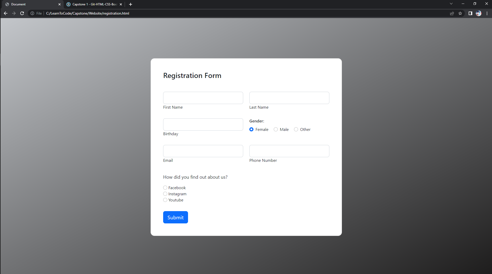

# Website
e-commerce website

I choose to create a Store website for my first capstone project with different types of consoles and video games. I choose this because I'm an expert on anything tech and video game realated. The website consists of 5 different pages as shown below.
Assassin's creed is one of my favorite video game titles, which is why I centered the banner and name towards that. The color scheme had to be similar throughout which is why I choose gray/white colors.

Working on the entire website was a lot of fun, sure it was a bit stressful because some images or containers wouldn't position themselves the way I wanted to.
Even so, a piece of code I found both interesting and fun while working on my website was defintely this one right above.
Adding icons, and dropdown options for the radio buttons, and images that have a hover effect, with the left side of the checkout page having your items in car was defintely a great feeling to achieve.